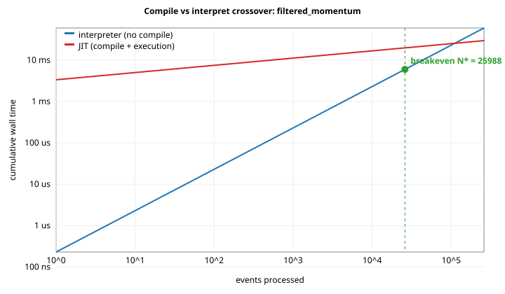

# Compile-vs-interpret crossover: `filtered_momentum`

Source: `examples/filtered_momentum.sig`  
Methodology: see [`docs/compile_runtime_crossover.md`](../../../docs/compile_runtime_crossover.md). Compile time is best-of-7; per-event time is best-of-5 over 200000 events each (5% warmup excluded, closed-loop, no batching).

## Compile breakdown (best run)

| Phase | ns | % of total |
|---|---:|---:|
| AST -> IR emission | 186903 | 5.59739% |
| LLVM O2 pipeline | 792286 | 23.7275% |
| ORC codegen + lookup | 2349471 | 70.3622% |
| **total (best of 7)** | **3339108** | 100% |
| total (median of 7) | 4392676 | |

## Per-event cost (best run)

| Configuration | ns/event |
|---|---:|
| interpreter | 229.236 |
| JIT (warm)  | 100.751 |

## Crossover

`N* = T_compile / (per_event_interp - per_event_jit)`  
`N* = 3339108 / (229.236 - 100.751) = **25988 events**`

Equivalently: the JIT pays for itself after about 0.00595747 s of warm event processing (assuming all warm calls go to the JIT).

If you only process **less than 25988** events per session, the interpreter is the better choice (no compile to pay for).

## Plot

