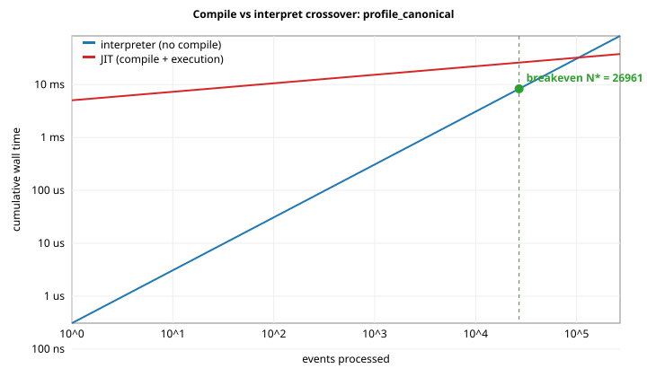

# Compile-vs-interpret crossover: `profile_canonical`

Source: `examples/profile_canonical.sig`  
Methodology: see [`docs/compile_runtime_crossover.md`](../../../docs/compile_runtime_crossover.md). Compile time is best-of-7; per-event time is best-of-5 over 200000 events each (5% warmup excluded, closed-loop, no batching).

## Compile breakdown (best run)

| Phase | ns | % of total |
|---|---:|---:|
| AST -> IR emission | 241476 | 4.78724% |
| LLVM O2 pipeline | 1309730 | 25.9653% |
| ORC codegen + lookup | 3433408 | 68.067% |
| **total (best of 7)** | **5044161** | 100% |
| total (median of 7) | 5190695 | |

## Per-event cost (best run)

| Configuration | ns/event |
|---|---:|
| interpreter | 308.482 |
| JIT (warm)  | 121.39 |

## Crossover

`N* = T_compile / (per_event_interp - per_event_jit)`  
`N* = 5044161 / (308.482 - 121.39) = **26960 events**`

Equivalently: the JIT pays for itself after about 0.00831696 s of warm event processing (assuming all warm calls go to the JIT).

If you only process **less than 26960** events per session, the interpreter is the better choice (no compile to pay for).

## Plot

