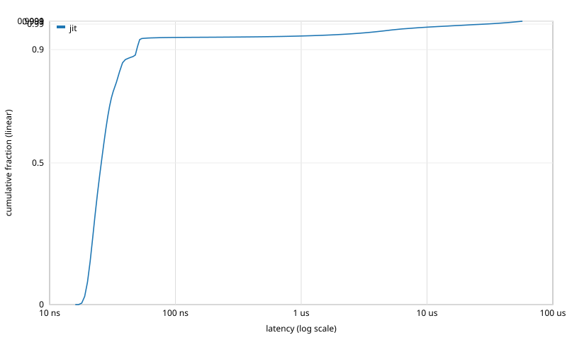

# Latency distribution: `spread_signal`

Events: 400000  
Warmup: 20000  
Mode: open-loop CO-aware @ 20000000.000000 Hz  
Source: `examples/spread_signal.sig`  
Methodology: per-call timing via `std::chrono::steady_clock::now()`. The histogram is HdrHistogram-style log-linear with 4 precision bits (~6% bucket width). See [`docs/latency_distribution.md`](../../../docs/latency_distribution.md) for full methodology.

## jit

Total samples: 400000  
Min: 16 ns  
Max: 56602 ns

| Percentile | Latency (ns) |
|---|---:|
| p50 | 25 |
| p75 | 31 |
| p90 | 49 |
| p99 | 29184 |
| p99.9 | 54272 |
| p99.99 | 56320 |
| p99.999 | 56320 |
| max | 56602 |

## Throughput cross-check

| Configuration | Wall time (s) | Throughput (events/s) | Sink |
|---|---:|---:|---:|
| jit | 0.0200002 | 1.99998e+07 | -2.7472e+06 |

## CDF

