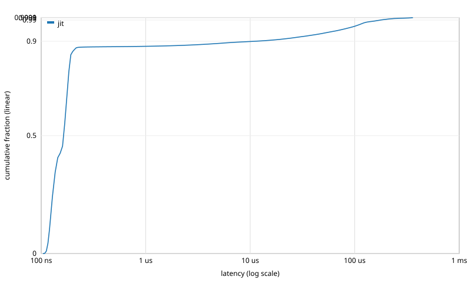

# Latency distribution: `filtered_momentum`

Events: 400000  
Warmup: 20000  
Mode: open-loop CO-aware @ 4000000.000000 Hz  
Source: `examples/filtered_momentum.sig`  
Methodology: per-call timing via `std::chrono::steady_clock::now()`. The histogram is HdrHistogram-style log-linear with 4 precision bits (~6% bucket width). See [`docs/latency_distribution.md`](../../../docs/latency_distribution.md) for full methodology.

## jit

Total samples: 400000  
Min: 104 ns  
Max: 358095 ns

| Percentile | Latency (ns) |
|---|---:|
| p50 | 164 |
| p75 | 180 |
| p90 | 11008 |
| p99 | 176128 |
| p99.9 | 335872 |
| p99.99 | 352256 |
| p99.999 | 352256 |
| max | 358095 |

## Throughput cross-check

| Configuration | Wall time (s) | Throughput (events/s) | Sink |
|---|---:|---:|---:|
| jit | 0.1 | 3.99999e+06 | nan |

## CDF

