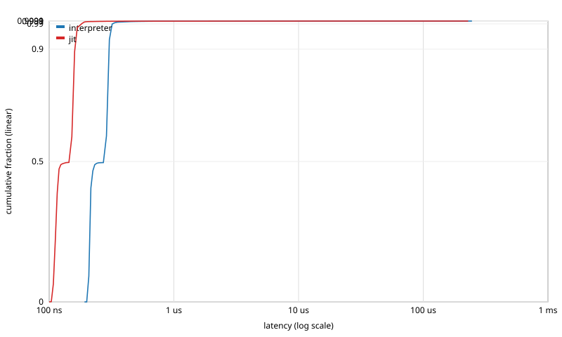

# Latency distribution: `filtered_momentum`

Events: 1000000  
Warmup: 50000  
Mode: closed-loop (back-to-back calls)  
Source: `examples/filtered_momentum.sig`  
Methodology: per-call timing via `std::chrono::steady_clock::now()`. The histogram is HdrHistogram-style log-linear with 4 precision bits (~6% bucket width). See [`docs/latency_distribution.md`](../../../docs/latency_distribution.md) for full methodology.

## interpreter

Total samples: 1000000  
Min: 199 ns  
Max: 245224 ns

| Percentile | Latency (ns) |
|---|---:|
| p50 | 280 |
| p75 | 296 |
| p90 | 296 |
| p99 | 328 |
| p99.9 | 560 |
| p99.99 | 11008 |
| p99.999 | 124928 |
| max | 245224 |

## jit

Total samples: 1000000  
Min: 101 ns  
Max: 221434 ns

| Percentile | Latency (ns) |
|---|---:|
| p50 | 148 |
| p75 | 156 |
| p90 | 164 |
| p99 | 180 |
| p99.9 | 280 |
| p99.99 | 7808 |
| p99.999 | 135168 |
| max | 221434 |

## Throughput cross-check

| Configuration | Wall time (s) | Throughput (events/s) | Sink |
|---|---:|---:|---:|
| interpreter | 0.277602 | 3.60228e+06 | nan |
| jit | 0.158343 | 6.31541e+06 | nan |

## CDF

