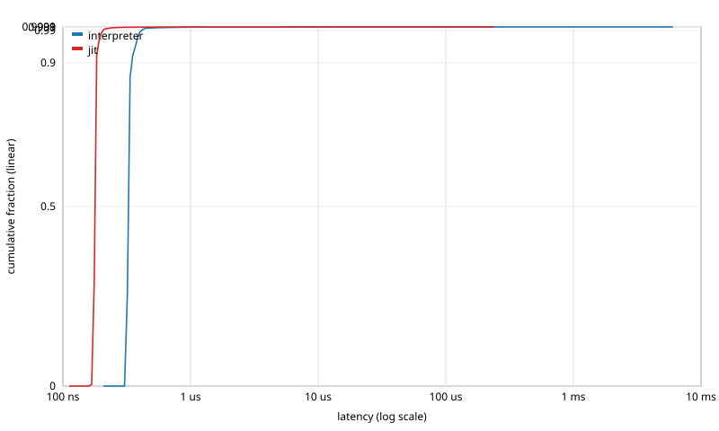

# Latency distribution: `profile_canonical`

Events: 1000000  
Warmup: 50000  
Mode: closed-loop (back-to-back calls)  
Source: `examples/profile_canonical.sig`  
Methodology: per-call timing via `std::chrono::steady_clock::now()`. The histogram is HdrHistogram-style log-linear with 4 precision bits (~6% bucket width). See [`docs/latency_distribution.md`](../../../docs/latency_distribution.md) for full methodology.

## interpreter

Total samples: 1000000  
Min: 209 ns  
Max: 5781482 ns

| Percentile | Latency (ns) |
|---|---:|
| p50 | 328 |
| p75 | 328 |
| p90 | 344 |
| p99 | 408 |
| p99.9 | 816 |
| p99.99 | 28160 |
| p99.999 | 143360 |
| max | 5781482 |

## jit

Total samples: 1000000  
Min: 112 ns  
Max: 236747 ns

| Percentile | Latency (ns) |
|---|---:|
| p50 | 180 |
| p75 | 180 |
| p90 | 180 |
| p99 | 204 |
| p99.9 | 328 |
| p99.99 | 10496 |
| p99.999 | 143360 |
| max | 236747 |

## Throughput cross-check

| Configuration | Wall time (s) | Throughput (events/s) | Sink |
|---|---:|---:|---:|
| interpreter | 0.363879 | 2.74817e+06 | nan |
| jit | 0.204356 | 4.89343e+06 | nan |

## CDF

