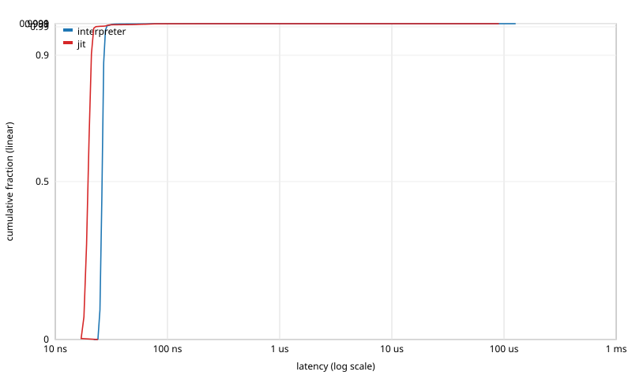

# Latency distribution: `spread_signal`

Events: 1000000  
Warmup: 50000  
Mode: closed-loop (back-to-back calls)  
Source: `examples/spread_signal.sig`  
Methodology: per-call timing via `std::chrono::steady_clock::now()`. The histogram is HdrHistogram-style log-linear with 4 precision bits (~6% bucket width). See [`docs/latency_distribution.md`](../../../docs/latency_distribution.md) for full methodology.

## interpreter

Total samples: 1000000  
Min: 22 ns  
Max: 124658 ns

| Percentile | Latency (ns) |
|---|---:|
| p50 | 26 |
| p75 | 26 |
| p90 | 27 |
| p99 | 28 |
| p99.9 | 41 |
| p99.99 | 126 |
| p99.999 | 11008 |
| max | 124658 |

## jit

Total samples: 1000000  
Min: 15 ns  
Max: 89057 ns

| Percentile | Latency (ns) |
|---|---:|
| p50 | 19 |
| p75 | 20 |
| p90 | 20 |
| p99 | 22 |
| p99.9 | 70 |
| p99.99 | 172 |
| p99.999 | 5504 |
| max | 89057 |

## Throughput cross-check

| Configuration | Wall time (s) | Throughput (events/s) | Sink |
|---|---:|---:|---:|
| interpreter | 0.0437315 | 2.28668e+07 | -1.59043e+07 |
| jit | 0.0366686 | 2.72713e+07 | -1.59043e+07 |

## CDF

