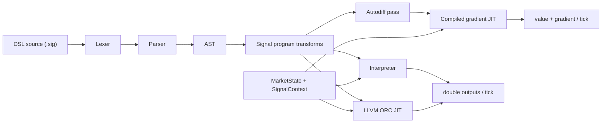

# Architecture Overview

`jit-signal-engine` is a C++20 trading-signal DSL engine. It parses `.sig` programs, lowers them to a typed AST, and executes them through two backends:

- an interpreter that serves as the correctness oracle
- an optional LLVM ORC JIT that produces native x86-64 code when LLVM is available

The current codebase also includes:

- whole-program fusion via `CompileProgram`
- a compiled gradient path via `CompileProgramGradient`
- stateful-operator IR lowering (default `kAll`; all 14 stateful ops inline)
- cross-symbol vectorization (`CompileProgramVectorized`, K=2/4/8) with P4 per-lane lowered fan-out
- AVX2-gated SIMD lowering for eligible rolling-window codegen
- multi-symbol struct-of-arrays execution
- recorded-data backtesting over mdh canonical journals

## High-Level Pipeline

## Core Stages

### 1. Parsing and Program Assembly

- `src/lexer.*` tokenizes identifiers, numbers, operators, and punctuation.
- `src/parser.*` builds the expression tree with precedence and conditional handling.
- `src/signal_program.*` performs multi-signal assembly, dependency inlining, cycle checks, and stable node-id allocation.

The runtime model is intentionally node-indexed rather than map-based on the hot path.

### 2. Runtime State Model

- `src/runtime.*` owns `MarketState`, `SignalContext`, and helper state for rolling operators.
- Stateful operators are keyed by stable integer `node_id` values.
- `SignalContext` uses preallocated vectors and symbol-indexed storage instead of hot-path hash lookups.
- `MultiSymbolSignalContext` supports struct-of-arrays style reuse of one compiled program across many symbols.

### 3. Execution Backends

- `src/interpreter.*` provides the reference execution path.
- `src/jit_compiler.*` lowers AST/program IR into LLVM IR and native code.
- `src/autodiff.*` provides the operator-level sensitivity logic and the interpreted gradient reference path.
- `src/signal_backend.*` provides the backend abstraction used by the CLI and benchmarks.
- `src/main.cpp` drives CLI execution, replay, and benchmark timing.

The JIT is optional. When LLVM is unavailable, the project still builds and the interpreter remains the correctness path.

## CompileProgram

`JitCompiler::CompileProgram` compiles a full inlined signal program into a single native function.

Why that matters:

- it replaces repeated per-signal interpreter traversal with one native call per tick
- it exposes more cross-signal optimization opportunity inside one LLVM function
- it is the code path behind the project's multi-signal fused benchmarks

The current evidence set supports dispatch reduction and native-code generation. Fused-program market bid/ask load deduplication is **Verified** on `filtered_momentum.sig` (IR **22→2** pre-O2 after emitter entry preload and memoization; see `bench/results/cse_evidence/cse_diff_verified.md` and `cse_load_dedup_test`). LLVM CSE alone did not achieve this across opaque `jit_rt_*` calls.

## Autodiff / Gradient Compile Path

Autodiff reuses the same signal IR rather than introducing a separate model format.

- Programs opt into trainable scalars with top-level `param name = value` declarations.
- `src/autodiff.*` defines stateless derivatives within a tick and persistent sensitivity-state recurrences for recurrent/windowed operators.
- `JitCompiler::CompileProgramGradient` emits a second fused whole-program function that returns primal outputs and the gradient for one selected `param_id`.
- `gradient_parity_test` gates interpreted gradients against central finite differences and compiled gradients against the interpreted path.
- `cli/jitse_calibrate.cpp` drives Adam over the checked-in CSV fit-to-target fixture using the compiled gradient function, with artifacts under `bench/results/autodiff/` and CI coverage via `calibration_smoke_test`.

The current calibration demo is intentionally fixture-backed. The recorded-data IC/backtest calibration path remains out of scope at HEAD because its checked-in artifact is still broken.

## Stateful Operator Lowering

Production JIT uses `StatefulLoweringFlags::kAll` by default: every stateful operator emits inline LLVM IR instead of opaque `jit_rt_*` calls. Lowered state array bases load via `SignalContext::lowered_bases` GEP (Phase 3). Evidence:

- parity: `stateful_lowering_parity_test`, `fuzz_parity_test`
- profile: `jit_rt_*` **80% → 2.8%** on fused `filtered_momentum` (`bench/results/perf/filtered_momentum/runtime_call_profile.md`)
- JIT vs hand-written C++: fused **1.42×** (`bench/results/lowering_gap_phase3/`)
- P4: lowered ops compose with vectorized compile via per-lane `LaneEmitScope` (`vectorized_stateful_parity_test` under `kAll`; perf `bench/results/stateful_vec_lowering_speedup.md`)

Set `JITSE_LOWER_STATEFUL=none` for the opaque-runtime differential path.

## SIMD Path

The JIT includes AVX2-gated lowering for eligible rolling-window codegen, currently centered on `sma`.

- runtime feature detection decides whether AVX2 lowering is enabled
- scalar fallback remains available
- `fuzz_parity_simd_test` checks scalar-vs-SIMD agreement
- `bench/results_simd.csv` captures the current benchmark artifact for this path

This is a targeted optimization, not a blanket vectorization claim for every operator.

## Multi-Symbol Path

The project supports multi-symbol execution with a single compiled program reused across symbol slots.

- symbol state is stored in `MultiSymbolSignalContext`
- the JIT and runtime treat symbols as indexed lanes rather than independent program instances
- `fuzz_parity_multisymbol_test` covers parity against the single-symbol reference
- `bench/results_multisymbol.csv` captures scaling behavior through 10,000 symbols

## Backtest Path

The recorded-data backtest runner consumes mdh canonical journals and emits:

- `signals.csv`
- `ic_report.json`

The backtest workflow is documented in `docs/integration_with_mdh.md` and `docs/backtest_methodology.md`. `backtest_determinism_test` verifies that identical inputs produce identical IC sections.

## Key Modules

- `src/lexer.*`: DSL tokenization
- `src/parser.*`: precedence-based parsing
- `src/ast.*`: AST types
- `src/signal_program.*`: dependency inlining, node allocation, program construction
- `src/runtime.*`: market state and per-node runtime storage
- `src/interpreter.*`: semantic reference
- `src/jit_compiler.*`: LLVM lowering, symbol registration, IR dumping, SIMD lowering
- `src/signal_backend.*`: backend abstraction for CLI and benchmarks
- `src/market_sim.*`: deterministic market-event generation for tests and benchmarks
- `examples/backtest_runner.cpp`: recorded-data backtest entrypoint

## Verified Test Coverage

The architecture is currently anchored by these tests:

- `fuzz_parity_test`
- `fuzz_parity_simd_test`
- `fuzz_parity_multisymbol_test`
- `vectorized_lanes_parity_test`, `vectorized_stateful_parity_test`
- `stateful_lowering_parity_test`, `runtime_call_profile_test`
- `hot_path_allocation_test`
- `gradient_parity_test`
- `calibration_smoke_test`
- `backtest_determinism_test`
- `node_state_layout_test`
- `jit_test`
- `signal_program_test`

## Current Boundaries

- Interpreter/JIT parity is the correctness gate.
- Benchmark values are artifact-specific and environment-specific.
- Fused market load dedup is verified (IR 22→2); canonical speedups use `bench/PINNED_HOST.md`.
- The codebase is a focused signal engine, not a general-purpose compiler platform.

## Practical Entry Points

- Build (WSL): `cmake -S . -B build-wsl -DCMAKE_BUILD_TYPE=Release`
- Build: `cmake --build build-wsl -j`
- Test: `ctest --test-dir build-wsl --output-on-failure`
- Signal benchmark: `bash bench/run_benchmarks.sh ./build-wsl ./bench/results.csv 0 1000000`
- Windows benchmark: `.\bench\run_benchmarks.ps1 -BuildDir .\build\Release -OutCsv .\bench\results.csv -PinCore 0 -Events 1000000`
