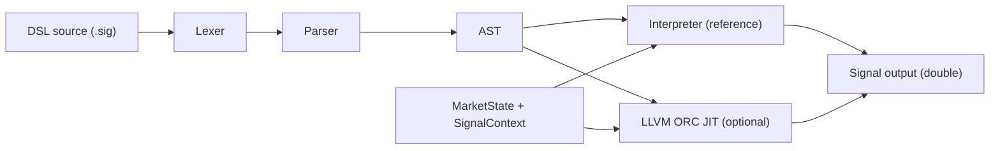

# Architecture Overview

This engine compiles a small signal DSL into executable code that evaluates against a live `MarketState`.

## Dataflow

## Core Modules

- `src/lexer.*`: tokenizes DSL input.
- `src/parser.*`: recursive-descent parser with precedence handling.
- `src/ast.h`: typed AST nodes.
- `src/signal_program.*`: multi-signal parsing, dependency inlining, cycle checks.
- `src/runtime.*`: market data structs and stateful rolling-window state.
- `src/interpreter.*`: tree-walking correctness baseline.
- `src/jit_compiler.*`: LLVM ORC backend (auto-disabled when LLVM is not found).
- `src/signal_backend.*`: backend abstraction (`CompiledSignal`) used by CLI/bench runners.
- `src/market_sim.*`: synthetic streaming market event generator.

## Runtime Contracts

- Compiled/interpreted entry shape: `double f(MarketState*, SignalContext*)`.
- Arithmetic is `double` end-to-end.
- Stateful functions use `SignalContext` and are keyed by AST-node identity.
- `MarketState` is array-indexed by instrument ID to avoid hot-path string lookup.

## CompileProgram: Multi-Signal Native Evaluation

`JitCompiler::CompileProgram` compiles a full vector of inlined signals into a **single LLVM function** with signature `void f(MarketState*, SignalContext*, double* outputs)`. This matters in two concrete ways:

**1. Single call replaces N interpreter loops.**
The interpreter evaluates each signal separately with virtual-dispatch tree traversal. `CompileProgram` collapses all N signals into one native function call per tick, eliminating per-signal call overhead and interpreter dispatch.

**2. LLVM CSE on market-data loads.**
`mid`, `bid`, `ask`, and `spread` are emitted as direct GEP+load IR — not runtime calls. When multiple signals reference the same field (e.g., `mid(AAPL)` appears in both `short_ma` and `long_ma`), LLVM's O2 CSE/GVN pass deduplicates those loads within the single function. This is the "redundant market-data read elimination" the project targets.

**Scope of optimization — what LLVM cannot do.**
Stateful operators (`ema`, `sma`, `rolling_std`, `rolling_min`, `rolling_max`, `zscore`, `vwap`, `lag`, `cross_above`, `cross_below`) call back into opaque `extern "C"` runtime functions. LLVM cannot inline or CSE through these calls. State bookkeeping cost is identical between JIT and interpreter for these operators; the JIT advantage comes from eliminating dispatch overhead and hoisting pure market-data reads.

## Why This Split

- Interpreter gives deterministic correctness oracle.
- JIT focuses on arithmetic/control-flow hot path and cross-signal market-data deduplication.
- Rolling-window bookkeeping remains in C++ runtime for simplicity and testability.
