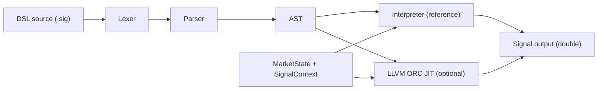

# Architecture Overview

This engine compiles a small signal DSL into executable code that evaluates against a live `MarketState`.

## Dataflow

## Core Modules

- `src/lexer.*`: tokenizes DSL input.
- `src/parser.*`: recursive-descent parser with precedence handling.
- `src/ast.h`: typed AST nodes.
- `src/signal_program.*`: multi-signal parsing, dependency inlining, cycle checks.
- `src/runtime.*`: market data structs and stateful rolling-window state.
- `src/interpreter.*`: tree-walking correctness baseline.
- `src/jit_compiler.*`: LLVM ORC backend (auto-disabled when LLVM is not found).
- `src/signal_backend.*`: backend abstraction (`CompiledSignal`) used by CLI/bench runners.
- `src/market_sim.*`: synthetic streaming market event generator.

## Runtime Contracts

- Compiled/interpreted entry shape: `double f(MarketState*, SignalContext*)`.
- Arithmetic is `double` end-to-end.
- Stateful functions use `SignalContext` and are keyed by AST-node identity.
- `MarketState` is array-indexed by instrument ID to avoid hot-path string lookup.

## Why This Split

- Interpreter gives deterministic correctness oracle.
- JIT focuses on arithmetic/control-flow hot path.
- Rolling-window bookkeeping remains in C++ runtime for simplicity and testability.
